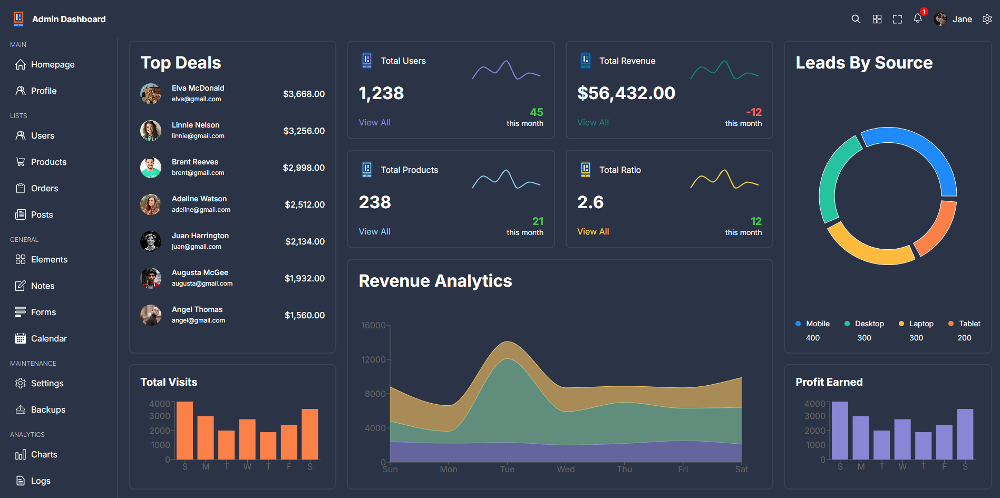

# Admin Dashboard

A responsive and modern admin dashboard built with **React.js** (using Vite) for seamless user management and data visualization. This project focuses on creating an intuitive front-end interface while showcasing essential design principles.



---

## 🚀 Features
- **Dynamic Dashboard Layout**: Organized structure with an easy-to-navigate UI.
- **Responsive Design**: Fully functional across devices (almost), ensuring mobile and desktop compatibility.
- **React.js Components**: Modular and reusable components for scalability.
- **Data Visualization**: Placeholder charts and graphs for potential integration with real data.

---

## 🛠️ Tech Stack
- **Front-End**: React.js, HTML, CSS, SCSS
- **Charts**: Recharts
- **Data Grid**: MUI DataGrid
- **Build Tool**: Vite
- **Other Tools**: Node.js, npm

---

## 📂 Project Structure
```
root
├── public/             # Static assets
├── src/
│   ├── components/     # Reusable components
│   ├── pages/          # Dashboard pages
│   ├── styles/         # Global and component-specific styles
│   └── App.jsx         # Entry point for the React app
└── package.json        # Dependencies and scripts
```

---

## 🚀 Getting Started

### Prerequisites
Ensure you have the following installed:
- **Node.js** (v16 or later)
- **npm** or **yarn** package manager

### Installation
1. Clone the repository:
   ```bash
   git clone https://github.com/TylerJarvis3256/AdminDashboard.git
   cd AdminDashboard
   ```

2. Install dependencies:
   ```bash
   npm install
   ```

3. Start the development server:
   ```bash
   npm run dev
   ```

4. Open your browser and navigate to:
   ```
   http://localhost:5173
   ```

---

## 🌟 Demo
https://admindashboard-demo.netlify.app/

---

## 📝 To-Do
- [ ] Edit menu and navigation to work across mobile devices
- [ ] Make data-grids responsive

---

## 💬 Contact
- **Author**: Tyler Jarvis
- **Email**: tylerjarvis3256@gmail.com
- **LinkedIn**: [Tyler Jarvis LinkedIn](https://linkedin.com/in/tyler-jarvis-b8a72023b)
- **GitHub**: [Tyler Jarvis GitHub](https://github.com/TylerJarvis3256)
